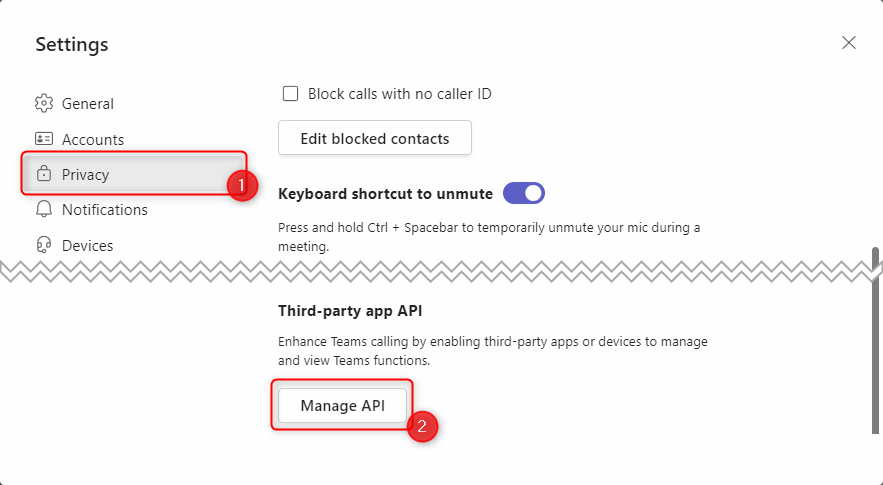
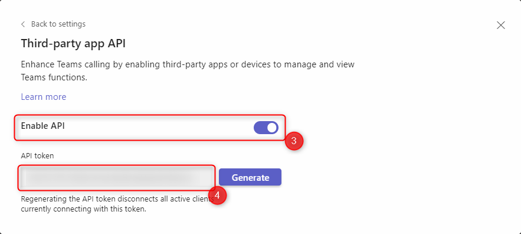

# Teams2Mqtt

This repository contains a Windows service that can send the current state of a Teams meeting through MQTT to Home Assistant. At the moment, the following Team meeting states are supported and converted to sensors:

- is muted
- is camera on
- is hand raised
- is in meeting
- is recording on
- is background blurred

The service uses the "third-party devices" API of Teams. This API uses a web socket connection and is also used by the Stream Deck integration. For further details about connecting third party services and devices see [the Teams support page](https://support.microsoft.com/en-us/office/connect-third-party-devices-to-teams-aabca9f2-47bb-407f-9f9b-81a104a883d6).

- [Installation](#installation)
- [Deinstallation](#deinstallation)
- [Configuration](#configuration)
  - [Logging](#logging)
  - [configuration](#configuration-1)
    - [Teams API Key](#teams-api-key)
  - [mqtt](#mqtt)
  - [sensorLocalizations](#sensorlocalizations)
- [Troubleshooting](#troubleshooting)
  - [Service does not start](#service-does-not-start)
- [Development](#development)
  - [Versioning](#versioning)
- [Acknolwedgements](#acknolwedgements)

## Installation

Currently, there is no automatic setup for this service available, so it has to be setup manually (given the purpose, I am confident that the target audience is able to install the service).

The application is a Windows service, so only Windows is supported. It uses .NET 7, so the [.NET Runtime](https://dotnet.microsoft.com/en-us/download/dotnet/7.0) must be available. To check if the correct version of .NET is installed, you can use the command `dotnet --list-runtimes` on the command line. This command shows all installed runtimes and should include an entry for "`Microsoft.NETCore.App`" with at least version 7.0.0.

After the current release of the software has been downloaded, the following steps are necessary to install the service:

- Extract the archive in a folder of your choice. It is recommended to place it in the "Program Files" directory.

- Modify the configuration file of the service to fit your environment. Details about the configuration can be found in the [below](#configuration).

- The Windows service itself is created/registered through the `sc` app that is available on Windows. The following command has to be changed for your environment and can be executed afterwards (requires Administrator permissions; PowerShell is recommended):

   ```powershell
   sc.exe create "Teams2Mqtt" binpath="<Path To App>\Teams2Mqtt.exe" start="delayed-auto"
   ```

   This command creates a new service with the name "Teams2Mqtt" that runs the given executable. The application will be started automatically but waits until more critical services with start type "Automatic" are started. If you want to start it sooner, you can change the start type to "`auto`" if you want. A detailed documentation about the the `sc.exe create` command can be found at [Microsoft Learn](https://learn.microsoft.com/en-us/windows-server/administration/windows-commands/sc-create).

- The service can log to the Windows Event Log. To enable this, a new category has to be created. This can be done using the following PowerShell command that has to be run with administrative permissions:

   ```powershell
   New-EventLog -LogName Teams2Mqtt -Source Teams2Mqtt
   ```

   Afterwards, a new log is created under "Applications and Services Logs". The log level can be configured    through the [application settings file](#configuration).

- The service is not started automatically after creation but only after a reboot. If you want to skip the reboot and use the application immediately, you can use the following PowerShell command (requires Administrator permissions):

   ```powershell
   Start-Service Teams2Mqtt
   ```

## Deinstallation

If you want to uninstall the service, you can uninstall the service service in a similar way:

- First you have to stop the service (PowerShell; requires Administrator permissions):

   ```powershell
   Stop-Service Teams2Mqtt
   ```

- Afterwards, you can remove the service with the familiar "sc.exe" tool (requires Administrator permissions):

   ```powershell
   sc.exe delete "Teams2Mqtt"
   ```

- If you created the Event Log category, you can delete it using the following PowerShell command (requires administrative permissions):

   ```powershell
   Remove-EventLog -LogName "Teams2Mqtt"
   ```

Further details about installing a .NET application as a Windows service can be found in the [Microsoft documentation](https://docs.microsoft.com/en-us/dotnet/core/extensions/windows-service).

## Configuration

The application is configured using the `appsettings.json` file. A JSON schema is available for the file, so it is recommended to use an editor that can leverage the schema information (e.g. [VS Code](https://code.visualstudio.com/)).

The source code contains the "[appsettings.Example.json](Teams2Mqtt/appsettings.Example.json)" and excludes the "normal" appsettings.json via the .gitignore file to prevent leaking of secrets. If you want to modify the code yourself, you can create a new appsettings.json and copy the content of the [appsettings.Example.json](Teams2Mqtt/appsettings.Example.json) to it so that you have a starting point. The compiled release version contains an "appsettings.json" that is based on the [appsettings.Example.json](Teams2Mqtt/appsettings.Example.json) file.

The individual sections of the configuration file are detailed in the following chapters.

### Logging

The application uses the default [.NET logging infrastructure](https://learn.microsoft.com/en-us/dotnet/core/extensions/logging?tabs=command-line) with built-in providers. When debugging or when running the application stand-alone, the most visible is the [Console Logger](https://learn.microsoft.com/en-us/dotnet/core/extensions/logging-providers#console). The application also uses the [Windows EventLog](https://learn.microsoft.com/en-us/dotnet/core/extensions/logging-providers#windows-eventlog).

```JSON
"Logging": {
    "LogLevel": {
        "Default": "Information",
        "Microsoft.Hosting.Lifetime": "Information"
    },
    "EventLog": {
        "LogLevel": {
            "Default": "Information",
            "Microsoft.Hosting.Lifetime": "Information"
        }
    }
}
```

The "`Logging`" section of the configuration file is the default configuration of the default .NET logging infrastructure. The `LogLevel` defines the default visibility of different logging levels. The first `LogLevel` in the example above is the logging level for the console output. Changes to the second `LogLevel` describes the logging levels that are logged for the Windows Event Log.

Valid values for the log level are (Descriptions taken from [Microsoft Learn](https://learn.microsoft.com/en-us/dotnet/core/extensions/logging?tabs=command-line#log-level)):

| LogLevel    | Description                                                                                                                                                        |
| ----------- | ------------------------------------------------------------------------------------------------------------------------------------------------------------------ |
| Trace       | Contain the most detailed messages. These messages may contain sensitive app data. These messages are disabled by default and should not be enabled in production. |
| Debug       | For debugging and development. Use with caution in production due to the high volume.                                                                              |
| Information | Tracks the general flow of the app. May have long-term value.                                                                                                      |
| Warning     | For abnormal or unexpected events. Typically includes errors or conditions that don't cause the app to fail.                                                       |
| Error       | For errors and exceptions that cannot be handled. These messages indicate a failure in the current operation or request, not an app-wide failure.                  |
| Critical    | For failures that require immediate attention. Examples: data loss scenarios, out of disk space.                                                                   |
| None        | Specifies that no messages should be written.                                                                                                                      |

Further information about the logging system can be found at <https://learn.microsoft.com/en-us/dotnet/core/extensions/logging?tabs=command-line>.

### configuration

The `configuration` section contains general application settings that mostly deal with the Teams Connection:

| Property                 |          | Description                                                                                                                                                                    |
| ------------------------ | -------- | ------------------------------------------------------------------------------------------------------------------------------------------------------------------------------ |
| `teamsApiKey`            | Required | The API Key that authenticates access to the Teams Web Socket. See [below](#teams-api-key) on how to retrieve the key.                                                         |
| `teamsWebSocketAddress`  | Optional | The address of the Teams Web Socket endpoint. This is normally "127.0.0.1" or "localhost". The default value is "`localhost`".                                                 |
| `teamsWebSocketPort`     | Optional | The port of the Teams Web Socket endpoint. The default value is `8124`.                                                                                                        |
| `teamsReconnectInterval` | Optional | The interval in seconds to wait before trying to reconnect to the Teams Web Socket endpoint if the connection was closed (or Teams is not running). The default value is `10`. |

#### Teams API Key

To access Teams through the Teams2Mqtt service, Teams must allow connections of third-party apps.



To allow this functionality, you have to open the Teams Settings and navigate to the Privacy tab (1). Afterwards, you have to scroll down to the "Third-party app API" section of the privacy tab. In this section, you have to click the "Manage API" button (2).



In the following screen, you have to make sure that the "Enable API" toggle is set to active (3). Afterwards, you can copy the "API token" from this screen (4).

This API token allows third party apps, like Teams2Mqtt or the Teams integration for the Elgato Stream Deck, access to some functionality of Teams. The [Teams support page](https://support.microsoft.com/en-us/office/connect-third-party-devices-to-teams-aabca9f2-47bb-407f-9f9b-81a104a883d6) also has a manual on how to manage this setting.

### mqtt

The `mqtt` section of the `appsettings.json` configures the connection to the MQTT broker as well as some Home Assitant specific configuration settings:

| Property                          |          | Description                                                                                                                                                                                                      |
| --------------------------------- | -------- | ---------------------------------------------------------------------------------------------------------------------------------------------------------------------------------------------------------------- |
| `server`                          | Required | The address of the MQTT broker                                                                                                                                                                                   |
| `port`                            | Required | The port of the MQTT broker                                                                                                                                                                                      |
| `username`                        | Optional | The username that is used to authenticate with the MQTT broker. This setting is only needed if authentication is enabled for the MQTT broker.                                                                    |
| `password`                        | Optional | The password that is used to authenticate with the MQTT broker. This setting is only needed if authentication is enabled for the MQTT broker.                                                                    |
| `mqttLoggingEnabled`              | Optional | If enabled, the MQTTnet client will also output log messages.                                                                                                                                                    |
| `homeAssistantAutodiscoveryTopic` | Optional | The prefix of the topic to use for MQTT auto discovery by Home Assistant. The default value is "`homeassistant`". See <https://www.home-assistant.io/integrations/mqtt/#mqtt-discovery> for further information. |
| `removeDevicesOnShutdown`         | Optional | If enabled, the devices will be removed from Home Assistant when the service is stopped. Default value is `false`.                                                                                               |
| `deviceSuggestedArea`             | Optional | The suggested area for the created device in Home Assistant. See <https://www.home-assistant.io/integrations/sensor.mqtt/#suggested_area> for further details.                                                   |

### sensorLocalizations

The service creates sensors in Home Assistant using [MQTT Discovery](https://www.home-assistant.io/integrations/mqtt/#mqtt-discovery). Part of the auto discovery messages are names for the sensors that should be created in Home Assistant. By default, the Teams2Mqtt service uses English names for the sensors, but it is possible to localize them on creation. This is done in the `sensorLocalizations` section. This is an array that contains localization objects consisting of a `sensorId` and a `sensorName`. The `sensorId` is unique and pre-defined (see table below) whereas the `sensorName` is the localized name of the sensor in your language. If a localization is missing, the default value (i.e. the English name) is used.

The following `sensorId`s are currently defined:

| `sensorId`          | English name          |
| ------------------- | --------------------- |
| isMuted             | Is Muted              |
| isCameraOn          | Is Camera On          |
| isHandRaised        | Is Hand Raised        |
| isInMeeting         | Is In Meeting         |
| isRecordingOn       | Is Recording On       |
| isBackgroundBlurred | Is Background Blurred |

A German translation could be as follows:

```JSON
"sensorLocalizations": [
   {
     "sensorId": "isMuted",
     "sensorName": "Stummgeschaltet"
   },
   {
     "sensorId": "isCameraOn",
     "sensorName": "Kamera eingschaltet"
   },
   {
     "sensorId": "isHandRaised",
     "sensorName": "Hand gehoben"
   },
   {
     "sensorId": "isInMeeting",
     "sensorName": "In Besprechung"
   },
   {
     "sensorId": "isRecordingOn",
     "sensorName": "Aufnahme läuft"
   },
   {
     "sensorId": "isBackgroundBlurred",
     "sensorName": "Hintergrund unscharf"
   }
]
```

## Troubleshooting

### Service does not start

- Check if the appsettings.json is present and formatted correctly.
- Check if the Event Log contains messages. If the dedicated event log does not contain any messages, the general Windows Application Event Log (Event Viewer -> Windows Logs -> Application) might contain information.

## Development

### Versioning

The project uses [Nerdbank.GitVersioning](https://github.com/dotnet/Nerdbank.GitVersioning) for generating the version numbers.

## Acknolwedgements

This project is built on the research of other members of the community that were kind enough share it:

- [Teams Client Api Sample](https://github.com/GrillPhil/TeamsClientApiSample/) by [Philipp Bauknecht](https://github.com/GrillPhil)
- [Teams Monitor](https://github.com/svrooij/teams-monitor) by [Stephan van Rooij](https://github.com/svrooij)
- [Description of the Microsoft Teams WebSocket API](https://lostdomain.notion.site/Microsoft-Teams-WebSocket-API-5c042838bc3e4731bdfe679e864ab52a)
- [Teams 3rd Party Client-API](https://www.msxfaq.de/teams/apps/teams_3rd_party_client_api.htm) article (in German) by [Frank Carius](https://www.msxfaq.de/)